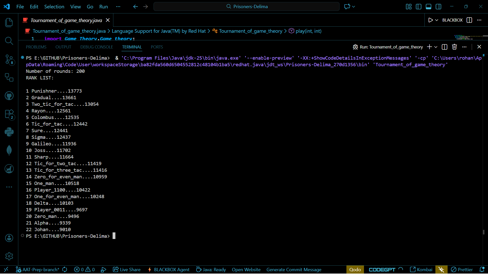

The Prisoner's Dilemma is a classic thought experiment in game theory, a field that studies how and why people make decisions when their outcomes depend on the choices of others.

### Descriptions of Tournament Strategies

| Slno | Strategy Name | Description |
|---|---|---|
| 1 | **One man (Cooperate)** | Always cooperates. It is a purely "nice" strategy that never initiates a defection. |
| 2 | **Zero man (Defect)** | Always defects. It aims to maximize its own score by exploiting cooperative players. |
| 3 | **One for Even Man** | A non-adaptive strategy that defects on odd-numbered rounds and cooperates on even-numbered rounds. |
| 4 | **Zero for Even Man** | The inverse of "One for Even Man". It cooperates on odd-numbered rounds and defects on even-numbered rounds. |
| 5 | **Player 1100** | Follows a repeating four-round cycle: Cooperate, Cooperate, Defect, Defect. |
| 6 | **Player 0011** | Follows a repeating four-round cycle: Defect, Defect, Cooperate, Cooperate. |
| 7 | **Alpha** | Follows a repeating four-round cycle: Defect, Cooperate, Cooperate, Cooperate. |
| 8 | **Delta** | Follows a repeating four-round cycle: Cooperate, Defect, Defect, Defect. |
| 9 | **Johan** | A counter to Tit-for-Tat. It does the opposite of the opponent's previous move. |
| 10 | **Rayon** | A complex, multi-phase strategy. It cooperates for 10 rounds, defects on round 11, then enters a reactive phase based on recent history and scores. |
| 11 | **Tit-for-Tat** | Starts by cooperating, then copies the opponent's previous move for all subsequent rounds. |
| 12 | **Tit-for-Two-Tats** | A more forgiving Tit-for-Tat. It only defects if the opponent has defected in the last two consecutive rounds. |
| 13 | **Tit-for-Three-Tats** | An even more lenient version. It defects only after the opponent has defected for three consecutive rounds. |
| 14 | **Two Tit for Tat** | Punishes a defection more severely. When an opponent defects, it retaliates by defecting for the next two rounds. |
| 15 | **Punisher (Grim Trigger)** | Cooperates until the opponent defects once, then defects for the rest of the match. |
| 16 | **Columbus** | A variation of Grim Trigger. It switches to permanent defection if the opponent defects for two consecutive rounds. |
| 17 | **Galileo** | Similar to Columbus but more tolerant. It switches to permanent defection if the opponent defects for three consecutive rounds. |
| 18 | **Gradual** | Punishments escalate over time. When the opponent defects for the Nth time, it retaliates by defecting for N rounds, then returns to cooperating. |
| 19 | **Sharp** | Makes a decision based on the first round. If the opponent cooperates on round 1, it always cooperates. If the opponent defects on round 1, it always defects. |
| 20 | **Sure** | Cooperates for the first two rounds. Afterwards, if the opponent has defected in the last two rounds AND has a higher score, it defects. Otherwise, it cooperates. |
| 21 | **Sigma** | Cooperates for the first three rounds. After that, it defects if the opponent's score is higher than its own, otherwise it cooperates. |
| 22 | **Joss (Win-Stay, Lose-Shift)** | Also known as Pavlov. It repeats its last move if it resulted in a high score (3 or 5 points), and switches its move if it resulted in a low score (0 or 1 point). |
| 23 | **Random** | Makes a random choice each round with a 50% chance of cooperating and a 50% chance of defecting. |

